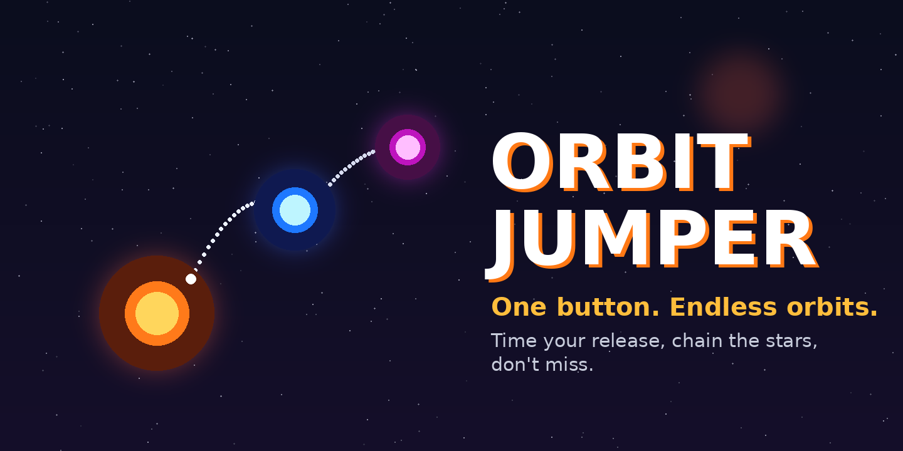
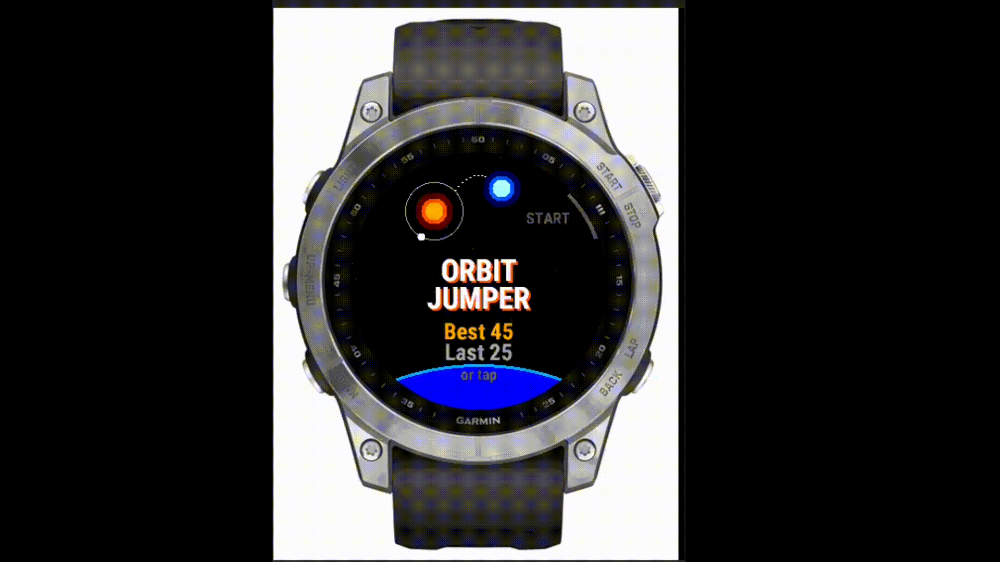
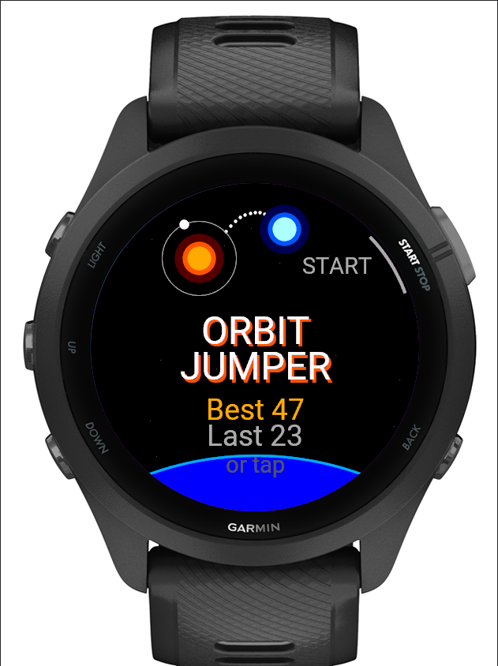
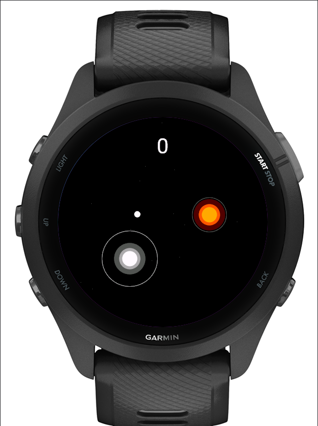
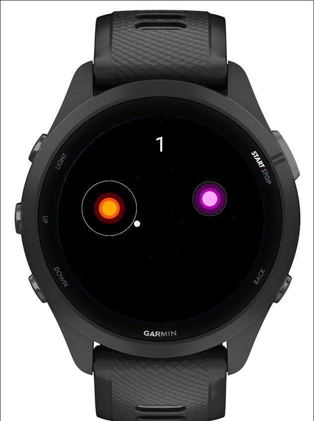
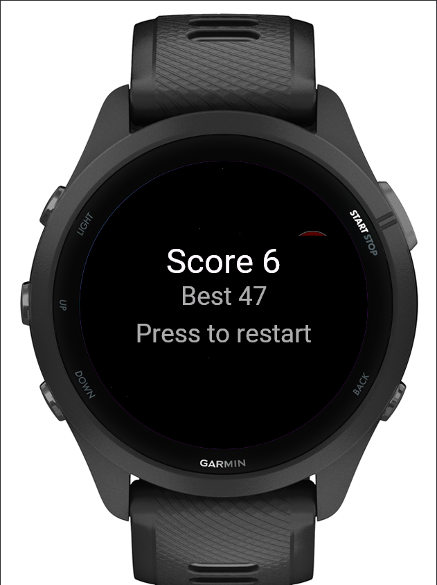

  

# OrbitJumper — Feedback & Issue Tracker

This is the public home for **OrbitJumper**, a one-input endless orbit-jumping
game for Garmin watches. Orbit a star, press start (or tap) to fling yourself
along the orbital tangent, and pass through the next star's capture ring to
score. Miss and it's game over.

**This repository does not contain the game's source code.** It exists so you
can report bugs, request features, ask questions, and share feedback. The app
itself is developed privately.

## 🎬 Demo

[**▶ Watch the demo on YouTube**](https://www.youtube.com/watch?v=hcG3NlXmpVc)

  

## 📲 Get the app

OrbitJumper runs on Garmin watches via the Connect IQ Store.

[**⌚ Get OrbitJumper on the Connect IQ Store**](https://apps.garmin.com/apps/909812b5-4688-4d1d-a716-535eb443585c)

## 📸 Screenshots

| Start menu | Aim your jump | In flight | Game over |
|:---:|:---:|:---:|:---:|
|  |  |  |  |

## 🐞 Found a bug or have an idea?

- **Bug reports** → [open a bug issue](../../issues/new?template=bug_report.yml)
- **Feature requests** → [open a feature issue](../../issues/new?template=feature_request.yml)
- **Questions, ideas & general feedback** → [start a discussion](../../discussions)

Before opening a new issue, please
[search existing issues](../../issues?q=is%3Aissue) — a quick 👍 on an
existing report helps me prioritize.

### What helps me fix things fast

- Your **watch model** (e.g. Fenix 7, Forerunner 265, Venu 2).
- The **app version** (shown on the Connect IQ Store listing).
- What you did, what you expected, and what actually happened.
- A photo or screen recording if the issue is visual.

Thanks for playing, and for helping make OrbitJumper better! 🚀
